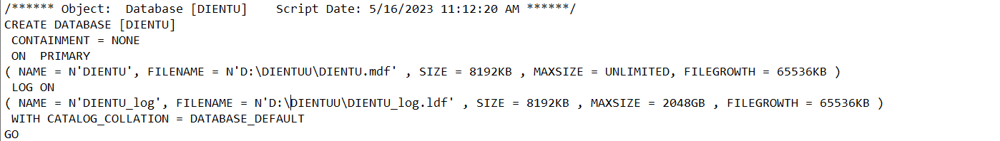

## WIPR-FINAL-PROJECT
A **C# application** to manage a electronics store.

---

## PREREQUISITE
> - **Visual Studio** ( preferably > 2019 )
    - **.NET desktop development** workload
    - **SQL** related Individual components
    - **LINQ to SQL** Individual components
> - **SQL Server** ( preferably > 2019 )

---

## SETUP
1. Load the database in `DIENTU Database.sql` by clicking on it.

2. Change the both the `FILENAME PATH` to `D:Drive` or ( `E:Drive` if you have ) but not `C:Drive`
    

        
    

3. Load the trigger script `DIENTU triggers script.sql`by clicking on it.

